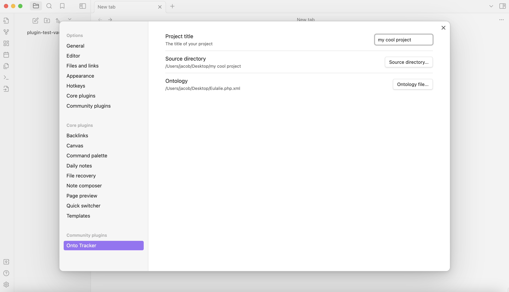
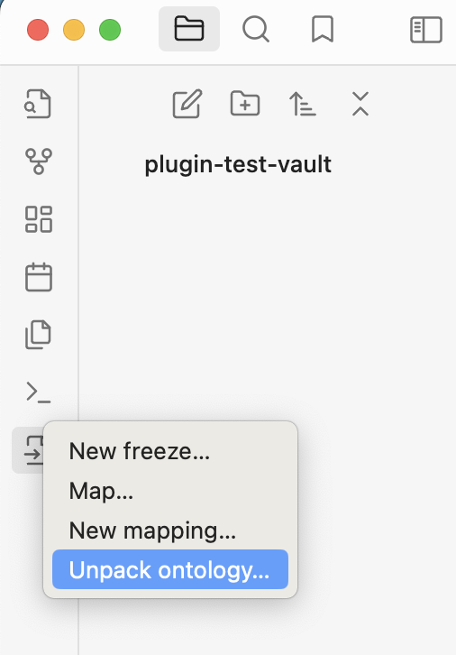
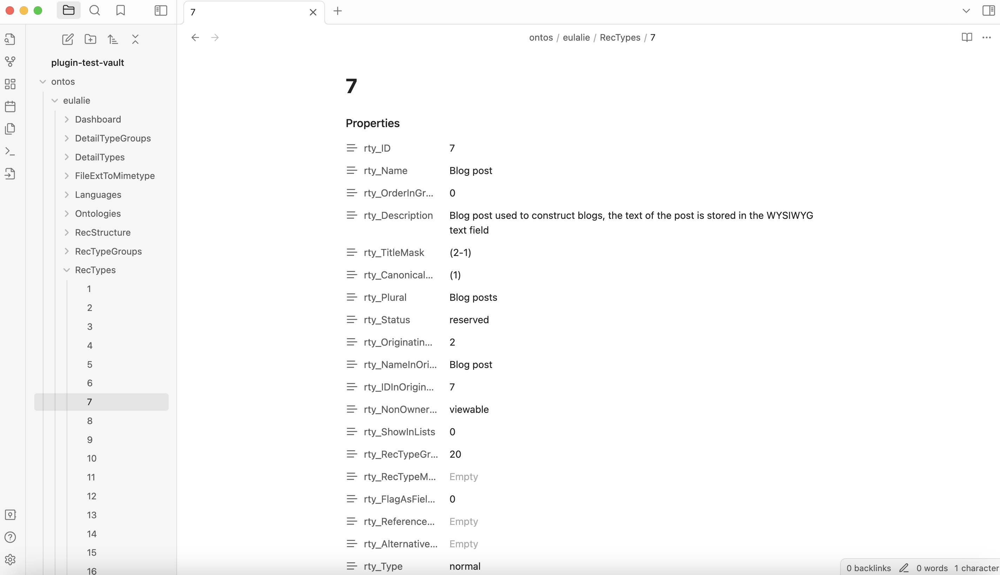
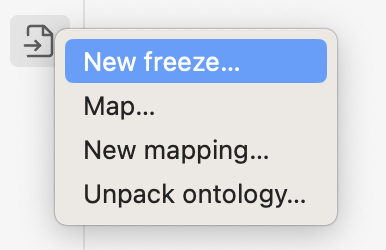
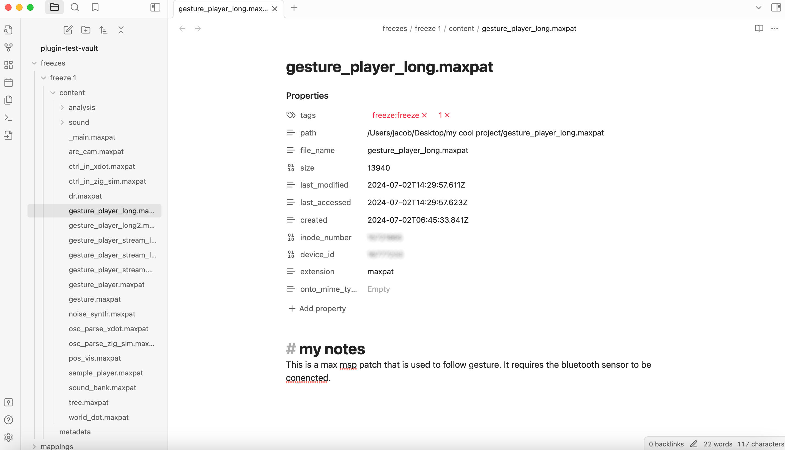
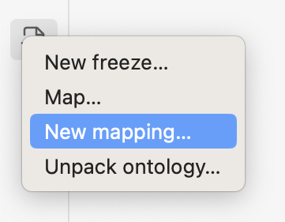
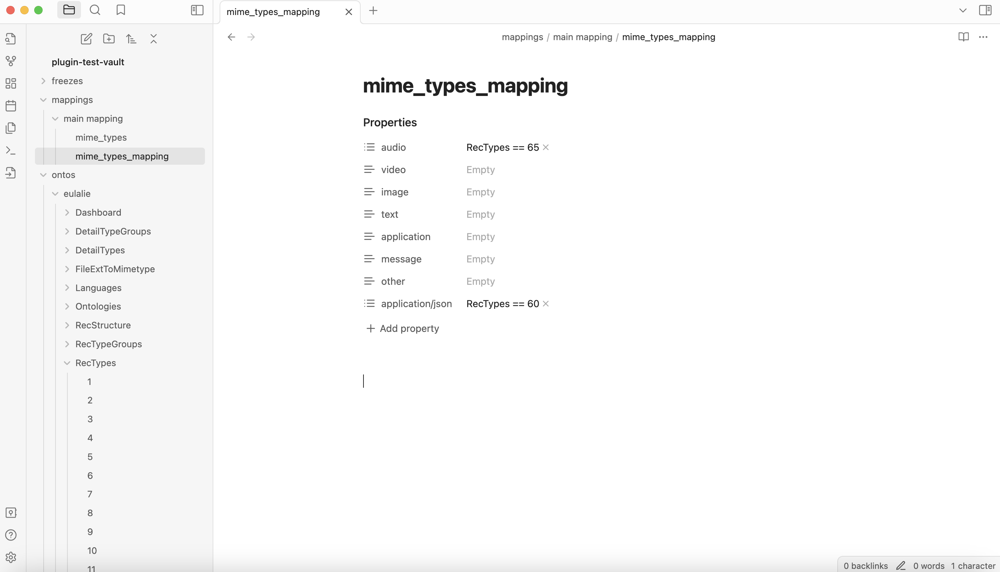
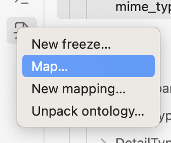
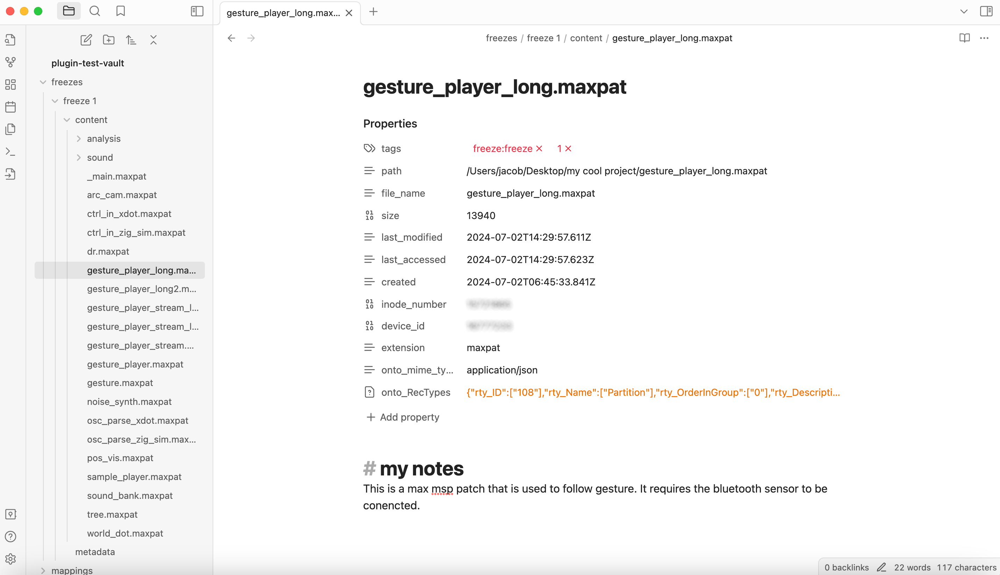

# Onto Tracker

**Manage projects according to an ontology.**

[](https://www.typescriptlang.org/)
[](https://obsidian.md/)
[](https://opensource.org/licenses/MIT)

Create an Obsidian vault that tracks the contents of a folder on your computer. Files are categorized according to a given ontology according to a set of user-defined rules. This content can then be parsed for tasks such as uploading content to a CMS (see some Python scripts for this [here](https://github.com/jdchart/onto-tracker-parse)).

[📺 Overview video](https://youtu.be/buvZarctQKc)

## Table of Contents

1. [Features](#features)
2. [Installation](#installation)
3. [Usage](#usage)
   - [Project Settings](#project-settings)
   - [Unpacking Ontologies](#unpacking-ontologies)
   - [Creating Freezes](#creating-freezes)
   - [Ontology Mapping](#ontology-mapping)
4. [Development](#development)
   - [Setup](#setup)
   - [Building](#building)
   - [Testing](#testing)
   - [Code Structure](#code-structure)
5. [API Reference](#api-reference)
6. [Roadmap](#roadmap)
7. [Contributing](#contributing)
8. [Acknowledgements](#acknowledgements)

## Features

- **📁 Project Tracking**: Monitor and categorize files in any folder according to ontological structures
- **❄️ Freeze Creation**: Create snapshots of your project state with metadata preservation
- **🗺️ Ontology Mapping**: Automatically classify files using customizable mapping rules
- **📖 Ontology Unpacking**: Convert complex XML ontologies into readable markdown documentation
- **🔗 Version Linking**: Track file evolution across multiple freezes
- **⚙️ Flexible Configuration**: Customize file processing rules and forbidden file types

## Installation

### From Obsidian Community Plugins

1. Open Settings in Obsidian
2. Navigate to Community Plugins and disable Safe Mode
3. Search for "Onto Tracker"
4. Install and enable the plugin

### Manual Installation

1. Download the latest release from GitHub
2. Extract the files to your vault's `.obsidian/plugins/onto-tracker/` directory
3. Enable the plugin in Obsidian settings

### Development Installation

```bash
# Clone the repository
git clone https://github.com/your-username/onto-tracker.git
cd onto-tracker

# Install dependencies
npm install

# Build the plugin
npm run build
```

## Usage

### Project Settings



1. **Activate the plugin** in Obsidian settings
2. **Set project title** - Give your project a meaningful name
3. **Configure source folder** - Select the folder containing files you want to track
4. **Choose ontology file** - Upload an ontology file ([example Eulalie ontology](https://zenodo.org/records/8084209/files/Eulalie.php.xml?download=1))

### Unpacking Ontologies



When the plugin is active, a menu appears in Obsidian's main ribbon:

1. **Click "Unpack ontology..."** to explore your ontology structure
2. **Set destination folder name** for the unpacked ontology
3. **View the results** in the generated `ontos` folder



The ontology is broken down into readable markdown files showing the hierarchical structure and relationships.

### Creating Freezes



Create 'freezes' (snapshots) of your tracked content:

1. **Click "New freeze..."** to start the process
2. **Configure freeze settings**:
   - **Name**: Descriptive name for this freeze
   - **Date**: When the freeze was created
   - **Detect existing files**: Link to previous versions if files existed before
   - **Ignore files**: Specify file types to exclude (e.g., `.DS_Store`, `.tmp`)



Each freeze creates:
- **Individual file records** with metadata and contextual notes
- **Metadata file** with freeze information
- **Content folder** containing all tracked files

### Ontology Mapping

#### Creating Mappings



1. **Click "New mapping..."** to create classification rules
2. **Name your mapping** for future reference
3. **Configure mapping rules** in the generated mapping files:



**Rule Format**: `ClassName == OntologyIndex`
- Example: `RecTypes == 65` (assigns audio files to RecTypes class, item 65)
- Supports MIME type hierarchies (e.g., `audio` vs `audio/wav`)

#### Applying Mappings



1. **Click "Map..."** to apply rules to a freeze
2. **Select target freeze** and **mapping configuration**
3. **Execute mapping** to automatically classify files



Files are updated with ontological metadata while preserving your notes.

## Development

### Setup

```bash
# Install dependencies
npm install

# Start development mode (watch for changes)
npm run dev

# Build for production
npm run build
```

### Building

The plugin uses ESBuild for fast compilation:

- **Development**: `npm run dev` - Watches for changes and rebuilds automatically
- **Production**: `npm run build` - Creates optimized build with TypeScript checking
- **Type Checking**: `npm run type-check` - Validates TypeScript without building

### Testing

The project includes comprehensive testing:

```bash
# Run unit tests
npm test

# Run tests in watch mode
npm run test:watch

# Generate coverage report
npm run test:coverage

# Run E2E tests (requires Obsidian setup)
npm run test:e2e

# Run linting
npm run lint
```

#### Test Structure

- **Unit Tests** (`__tests__/`): Test individual functions and components
- **Integration Tests**: Test component interactions and workflows
- **E2E Tests** (`e2e/`): Test complete user workflows in Obsidian

### Code Structure

```
├── main.ts                 # Plugin entry point
├── scripts/
│   ├── types.ts            # TypeScript interfaces and types
│   ├── utils.ts            # Utility functions
│   ├── procFreeze.ts       # Freeze processing logic
│   ├── freezeModal.ts      # Freeze creation modal
│   ├── mapMakerModal.ts    # Mapping creation modal
│   ├── mapModal.ts         # Mapping application modal
│   ├── unpackOntologyModal.ts # Ontology unpacking modal
│   ├── ribbonElements.ts   # Ribbon menu setup
│   ├── commandElements.ts  # Command registration
│   └── settingsElements.js # Settings UI elements
├── assets/
│   └── mime_types.js       # MIME type definitions
├── __tests__/              # Unit and integration tests
├── e2e/                    # End-to-end tests
└── docs/                   # Documentation images
```

#### Architecture Overview

The plugin follows a modular architecture:

1. **Main Plugin** (`main.ts`): Entry point, settings management
2. **Modal Components**: User interface for different operations
3. **Processing Functions**: Core business logic for freeze/mapping operations
4. **Utilities**: Shared functions for file operations and data processing
5. **Types**: TypeScript interfaces ensuring type safety

## API Reference

### Core Interfaces

```typescript
interface OntoTrackerSettings {
  projectTitle: string;
  sourceFolder: string;
  ontoFile: string;
}

interface FreezeSettings {
  freezeName: string;
  freezeDate: string;
  keepOld: boolean;
  forbidden: string;
}
```

### Main Classes

- **`OntoTracker`**: Main plugin class
- **`FreezeModal`**: Interface for creating freezes
- **`MapMakerModal`**: Interface for creating mappings
- **`MapModal`**: Interface for applying mappings
- **`UnpackOntologyModal`**: Interface for unpacking ontologies

### Utility Functions

- **`getUniqueFolderName()`**: Generate unique folder names
- **`listToOptions()`**: Convert arrays to dropdown options
- **`readXML()`**: Parse XML ontology files
- **`processFreeze()`**: Create project freezes

## Roadmap

### Completed ✅
- [x] TypeScript conversion and type safety
- [x] Comprehensive error handling
- [x] Unit and integration testing
- [x] Code refactoring and modernization
- [x] JSDoc documentation

### Planned 🚧
- [ ] Rule creation for folder placement
- [ ] Rule creation for file name parsing
- [ ] Implement "other" mime type parsing
- [ ] Eulalie default configuration
- [ ] Main project record creation
- [ ] Support for additional ontology formats (currently supports Heurist format)
- [ ] Process prevention when already in progress
- [ ] Performance optimizations

### Future Ideas 💡
- [ ] Real-time file monitoring
- [ ] Export to multiple formats (JSON, CSV, XML)
- [ ] Advanced search and filtering
- [ ] Collaborative ontology editing
- [ ] Integration with external systems

## Contributing

We welcome contributions! Please see our [Contributing Guide](CONTRIBUTING.md) for details.

### Development Workflow

1. Fork the repository
2. Create a feature branch (`git checkout -b feature/amazing-feature`)
3. Make your changes
4. Add tests for new functionality
5. Ensure all tests pass (`npm test`)
6. Update documentation as needed
7. Commit your changes (`git commit -m 'Add amazing feature'`)
8. Push to the branch (`git push origin feature/amazing-feature`)
9. Open a Pull Request

### Code Standards

- **TypeScript**: All new code should be written in TypeScript
- **Testing**: New features require corresponding tests
- **Documentation**: Public APIs must have JSDoc documentation
- **Linting**: Code must pass ESLint checks (`npm run lint`)

## Troubleshooting

### Common Issues

**Plugin not loading**
- Ensure all dependencies are installed (`npm install`)
- Check that the plugin is enabled in Obsidian settings
- Verify the build completed successfully (`npm run build`)

**TypeScript errors**
- Run type checking: `npm run type-check`
- Ensure all imports are correctly typed
- Check that Obsidian API types are up to date

**Test failures**
- Verify Node.js version compatibility
- Check that all test dependencies are installed
- Review mock configurations in test setup

## Acknowledgements

**Created by Jacob Hart.**

This project was initially created for the archival work at [Art Zoyd Studios](https://artzoydstudios.com/en/).

*Avec le soutien de la Région Bretagne.*

---

**🔧 Enhanced with TypeScript, Testing, and Modern Development Practices**